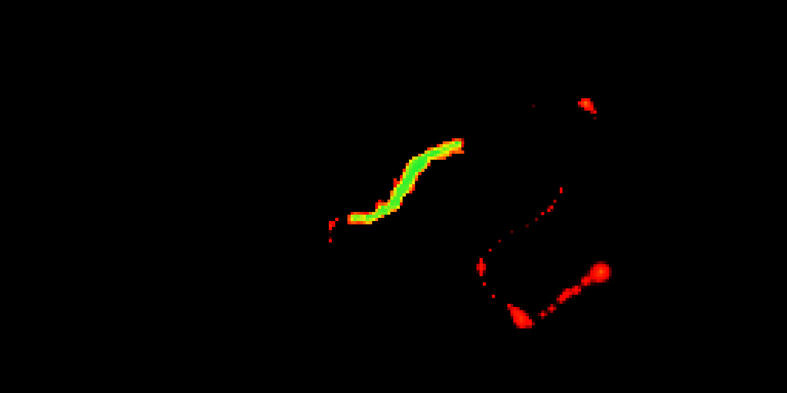

# Unity Heatmap Shader
Renders a heatmap grid on a quad mesh using a custom shader.

## References
- [How to pass a structured buffer in to fragment shader](https://forum.unity.com/threads/how-to-pass-a-structured-buffer-in-to-fragment-shader.862216/)
- [Buffer Type - Microsoft Docs](https://docs.microsoft.com/en-us/windows/win32/direct3dhlsl/dx-graphics-hlsl-buffer)
- [Code Monkey: Make Awesome Effects with Meshes in Unity | How to make a Mesh](https://www.youtube.com/watch?v=11c9rWRotJ8)
